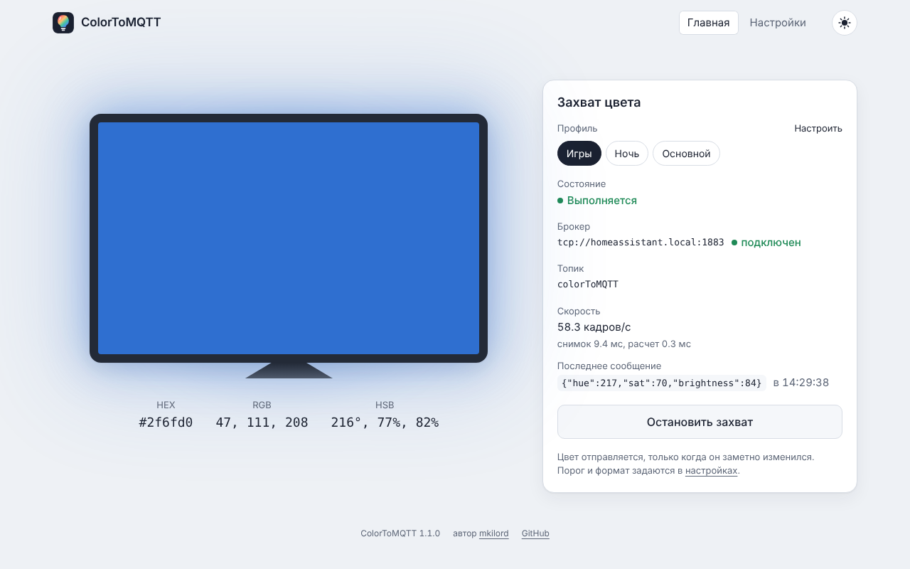
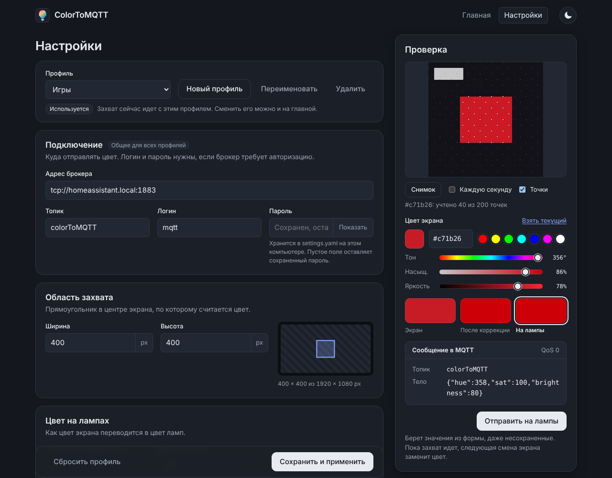

# ColorToMQTT

[](https://github.com/Mkilord/color-to-mqtt/actions/workflows/ci.yml)

Подсветка комнаты в цвет экрана. Приложение следит за центром монитора, определяет его цвет и отправляет в MQTT, а Home Assistant красит в этот цвет лампы.



## Возможности

- Цвет кадра считается тремя способами: преобладающий цвет (по умолчанию, не тускнеет от темного фона), среднее с упором на яркие цвета, простое среднее.
- Черный экран гасит лампы, серый дает белый свет в цветном режиме.
- Короткие вспышки отсекаются, чтобы лампы не мигали.
- Цвет поправляется под лампы: усиление насыщенности, поправка оттенка для шести опорных цветов, ограничение яркости.
- Профили настроек, например «Игры», «Фильмы», «Ночь». Профиль переключается на главной без остановки захвата.
- Веб-интерфейс со светлой и темной темой, статусом захвата и ошибками соединения.
- Панель проверки: снимок области захвата и отправка проверочного цвета на лампы прямо со страницы настроек.



## Требования

- Windows или другая система с графическим рабочим столом: снимок экрана делается через AWT
- JDK 22: `java` в `PATH` или переменная `JAVA_HOME`
- MQTT-брокер, например Mosquitto или аддон Mosquitto в Home Assistant

Maven ставить не нужно: в репозитории есть Maven Wrapper.

## Быстрый старт

```bat
git clone https://github.com/Mkilord/color-to-mqtt.git
cd color-to-mqtt
start.cmd
```

При первом запуске `start.cmd` собирает `target\color-to-mqtt.jar` и запускает его. Сборка через `mvnw.cmd` один раз скачивает Maven в `%USERPROFILE%\.m2`.

1. Откройте http://localhost:8080/settings.
2. Укажите адрес брокера (`tcp://<адрес>:1883`), топик и, если нужно, логин и пароль. Сохраните.
3. На главной нажмите «Запустить захват».

После обновления кода jar нужно пересобрать: `start.cmd build`.

## Сообщение MQTT

```json
{"hue":210,"sat":64,"brightness":48}
```

`hue` в градусах 0..360, `sat` и `brightness` в процентах 0..100. Яркость 0 означает черный экран. Сообщения уходят с QoS 0, только когда цвет заметно изменился.

## Автоматизация в Home Assistant

Автоматизация передает цвет лампам как есть, вся обработка уже сделана в приложении. Замените `light.living_room` на свои лампы и `colorToMQTT` на свой топик:

```yaml
alias: Подсветка по цвету экрана
mode: restart
triggers:
  - trigger: mqtt
    topic: colorToMQTT
actions:
  - if:
      - condition: template
        value_template: "{{ trigger.payload_json.brightness | int == 0 }}"
    then:
      - action: light.turn_off
        target:
          entity_id: light.living_room
    else:
      - action: light.turn_on
        target:
          entity_id: light.living_room
        data:
          hs_color:
            - "{{ trigger.payload_json.hue }}"
            - "{{ trigger.payload_json.sat }}"
          brightness_pct: "{{ trigger.payload_json.brightness }}"
```

Если оттенок на лампах не совпадает с экраном (например, зеленый уходит в бирюзовый), подберите поправку в блоке «Оттенки ламп» на странице настроек. Кнопка «Отправить на лампы» в панели проверки сразу показывает результат.

## Настройки

Все параметры меняются на странице настроек. Они хранятся в YAML в рабочей директории:

| Файл | Содержимое |
|---|---|
| `settings.yaml` | Подключение к брокеру (общее для всех профилей) и активный профиль |
| `profiles/<имя>.yaml` | Параметры профиля, только отличия от значений по умолчанию |

Логин и пароль MQTT хранятся в `settings.yaml` открытым текстом. Пароль не показывается на странице и не пишется в логи.

Подключение до первого сохранения можно задать переменными окружения:

| Переменная | Назначение | По умолчанию |
|---|---|---|
| `MQTT_BROKER` | Адрес брокера | `tcp://localhost:1883` |
| `MQTT_TOPIC` | Топик | `colorToMQTT` |
| `MQTT_USERNAME` | Пользователь | пусто |
| `MQTT_PASSWORD` | Пароль | пусто |

Папку с настройками меняет свойство `app.storage-dir`, например `java -jar target\color-to-mqtt.jar --app.storage-dir=D:\color-to-mqtt`.

## Документация

- [Как работает](docs/how-it-works.md): цикл захвата, расчет цвета и все параметры профиля
- [HTTP API](docs/api.md): запуск захвата, статус, профили, проверочный цвет
- [Устройство кода](docs/architecture.md): пакеты, роли слоев, сборка и тесты
- [История изменений](CHANGELOG.md)

## Автор

[mkilord](https://github.com/Mkilord)
